# 🚀 Complete CI/CD Pipeline dengan GitHub Actions, Helm, dan Kubernetes

[](https://github.com/features/actions)
[](https://www.docker.com/)
[](https://kubernetes.io/)
[](https://helm.sh/)

Dokumentasi lengkap untuk CI/CD pipeline yang mengimplementasikan **Semantic Versioning otomatis**, **Docker image builds**, **Helm chart packaging**, dan **Kubernetes deployments** menggunakan **self-hosted runners** dan integrasi **HashiCorp Vault**.

---

## 📋 Daftar Isi

- [Overview](#overview)
- [Arsitektur Pipeline](#arsitektur-pipeline)
- [Workflow Files](#workflow-files)
  - [Development Workflow](#1-development-workflow-devyaml)
  - [Staging Workflow](#2-staging-workflow-stagingyaml)
  - [Production Workflow](#3-production-workflow-productionyaml)
  - [DevOps Workflow](#4-devops-workflow-devopsyaml)
- [Semantic Versioning Strategy](#semantic-versioning-strategy)
- [Job Dependencies](#job-dependencies)
- [Secrets dan Variables](#secrets-dan-variables)
- [Self-Hosted Runners Setup](#self-hosted-runners-setup)
- [HashiCorp Vault Integration](#hashicorp-vault-integration)
- [Best Practices](#best-practices)

---

## Overview

Pipeline ini dirancang untuk mengelola deployment aplikasi containerized ke Kubernetes cluster dengan pendekatan **GitOps**. Setiap environment (Development, Staging, Production) memiliki workflow yang terpisah dengan karakteristik versioning yang unik.

```
┌─────────────────────────────────────────────────────────────────────────┐
│                        GitHub Actions CI/CD Pipeline                     │
├─────────────────────────────────────────────────────────────────────────┤
│                                                                          │
│   PR Merged ──► Extract ──► Build ──► Package ──► Deploy ──► Tag        │
│                Version     Docker     Helm        K8s       Git          │
│                                                                          │
└─────────────────────────────────────────────────────────────────────────┘
```

### Fitur Utama

| Fitur                                | Deskripsi                                                       |
| ------------------------------------ | --------------------------------------------------------------- |
| 🏷️ **Automatic Semantic Versioning** | Versi diekstrak dari PR title (`[major]`, `[minor]`, `[patch]`) |
| 🐳 **Docker Image Build & Push**     | Build dan push ke private registry                              |
| ⎈ **Helm Chart Packaging**           | Package dan push ke OCI registry                                |
| ☸️ **Kubernetes Deployment**         | Deploy menggunakan Helm dengan values per environment           |
| 🔐 **Vault Integration**             | Secrets management via HashiCorp Vault Agent Injector           |
| 🏃 **Self-Hosted Runners**           | Runners terpisah per environment untuk keamanan                 |

---

## Arsitektur Pipeline

```mermaid
flowchart TB
    subgraph Trigger["🎯 Trigger"]
        PR[Pull Request Merged]
    end

    subgraph Jobs["⚙️ GitHub Actions Jobs"]
        V[Extract & Calculate Version]
        D[Build & Push Docker]
        H[Package & Push Helm]
        K[Deploy to Kubernetes]
        T[Create & Push Git Tag]
    end

    subgraph Artifacts["📦 Artifacts"]
        IMG[(Docker Image)]
        CHT[(Helm Chart)]
        TAG[(Git Tag)]
    end

    subgraph Infrastructure["🏗️ Infrastructure"]
        REG[Container Registry]
        K8S[Kubernetes Cluster]
        VLT[HashiCorp Vault]
    end

    PR --> V
    V --> D
    D --> IMG
    IMG --> REG
    D --> H
    H --> CHT
    CHT --> REG
    H --> K
    K --> K8S
    K8S <--> VLT
    K --> T
    T --> TAG
```



---

## Workflow Files

### 1. Development Workflow (`dev.yaml`)

**Trigger:** Pull Request merged ke branch `dev`

**Versioning Pattern:** `v{major}.{minor}.{patch}-alpha`

```yaml
name: Dev Workflow - Package & Deploy Helm Chart

on:
  pull_request:
    types: [closed]
    branches: ["dev"]
```

#### Jobs Overview

| Job                        | Deskripsi                                             | Dependencies                                                  |
| -------------------------- | ----------------------------------------------------- | ------------------------------------------------------------- |
| `extract-and-calc-version` | Ekstrak versi dari PR title dan kalkulasi SemVer baru | -                                                             |
| `build-and-push-docker`    | Build Docker image dan push ke registry               | `extract-and-calc-version`                                    |
| `package-and-push-helm`    | Package Helm chart dan push ke OCI registry           | `extract-and-calc-version`, `build-and-push-docker`           |
| `deploy`                   | Deploy ke Kubernetes menggunakan Helm                 | `extract-and-calc-version`, `package-and-push-helm`           |
| `create-and-push-git-tag`  | Buat dan push Git tag                                 | `extract-and-calc-version`, `package-and-push-helm`, `deploy` |

#### Environment Variables

```yaml
env:
  REGISTRY_URL: ${{ vars.REGISTRY_URL }}
  IMAGE_NAME: ${{ vars.IMAGE_NAME }}
  NAMESPACE: ${{ vars.NAMESPACE }}
  CHART_PATH: ./helm/dev.yaml
  KUBE_CONFIG: ${{ secrets.KUBE_CONFIG }}
  DNS_NAME: ${{ vars.DNS_NAME }}
  VAULT_PATH: ${{ vars.VAULT_PATH }}
  VAULT_ROLE: ${{ vars.VAULT_ROLE }}
  VAULT_AUTH_PATH: ${{ vars.VAULT_AUTH_PATH }}
  CPU_LIMIT: ${{ vars.CPU_LIMIT }}
  MEMORY_LIMIT: ${{ vars.MEMORY_LIMIT }}
  CPU_REQUEST: ${{ vars.CPU_REQUEST }}
  MEMORY_REQUEST: ${{ vars.MEMORY_REQUEST }}
```

---

### 2. Staging Workflow (`staging.yaml`)

**Trigger:** Pull Request merged ke branch `stg`

**Versioning Pattern:** `v{major}.{minor}.{patch}-beta`

```yaml
name: Staging Workflow - Build and Push to Registry

on:
  pull_request:
    types: [closed]
    branches: ["stg"]
```

#### Version Calculation Logic

```bash
# Get latest beta tag
current_version=$(git tag --list '*-beta' --sort=-v:refname | head -n 1)
current_version=${current_version:-"v0.0.0-beta"}

# Parse version components
base_version=${current_version%-beta}
IFS='.' read -r major minor patch <<< "${base_version#v}"

# Increment based on PR title
case "$version_type" in
  major) major=$((major + 1)); minor=0; patch=0 ;;
  minor) minor=$((minor + 1)); patch=0 ;;
  patch|*) patch=$((patch + 1)) ;;
esac

new_version="v$major.$minor.$patch-beta"
```

---

### 3. Production Workflow (`production.yaml`)

**Trigger:** Pull Request merged ke branch `main`

**Versioning Pattern:** `v{major}.{minor}.{patch}` (stable release)

```yaml
name: Production Workflow - Build and Push to Registry

on:
  pull_request:
    types: [closed]
    branches: ["main"]
```

#### Key Differences dari Environment Lain

| Aspek              | Production                   | Staging/Dev               |
| ------------------ | ---------------------------- | ------------------------- |
| **Version Suffix** | None (stable)                | `-beta` / `-alpha`        |
| **Tag Filtering**  | Exclude `-alpha` dan `-beta` | Include suffix            |
| **Runner Group**   | `Production`                 | `Staging` / `Development` |
| **Environment**    | `production`                 | `staging` / `development` |

#### Production Version Calculation

```bash
# Filter out alpha and beta tags to get stable releases only
current_version=$(git tag --list | grep -v '\-alpha' | grep -v '\-beta' | sort -V -r | head -n 1)
current_version=${current_version:-"v0.0.0"}
```

---

### 4. DevOps Workflow (`devops.yaml`)

**Trigger:** Push atau PR merged ke branch `devops`

**Purpose:** Workflow untuk testing dan eksperimen pipeline

```yaml
name: DevOps Workflow - Build and Push to Registry

on:
  push:
    branches: ["devops"]
  pull_request:
    types: [closed]
    branches: ["devops"]
```

> [!NOTE]
> Workflow ini saat ini dalam tahap development. Docker build dan push steps di-comment untuk testing purposes.

---

## Semantic Versioning Strategy

Pipeline ini mengimplementasikan **Semantic Versioning (SemVer)** yang sepenuhnya otomatis berdasarkan PR title.

### PR Title Convention

Gunakan format berikut pada PR title untuk mengontrol versi:

| Keyword   | Contoh PR Title                | Version Change    |
| --------- | ------------------------------ | ----------------- |
| `[major]` | `[major] Breaking API changes` | `1.0.0` → `2.0.0` |
| `[minor]` | `[minor] Add new feature`      | `1.0.0` → `1.1.0` |
| `[patch]` | `[patch] Fix bug in login`     | `1.0.0` → `1.0.1` |
| _default_ | `Update documentation`         | `1.0.0` → `1.0.1` |

### Version Flow Across Environments

```
Development (alpha)     Staging (beta)        Production (stable)
─────────────────────────────────────────────────────────────────
v1.0.0-alpha     ──►    v1.0.0-beta    ──►    v1.0.0
v1.0.1-alpha     ──►    v1.0.1-beta    ──►    v1.0.1
v1.1.0-alpha     ──►    v1.1.0-beta    ──►    v1.1.0
```

---

## Job Dependencies

### Dependency Graph


### Job Execution Flow

```yaml
jobs:
  extract-and-calc-version:
    # No dependencies - runs first

  build-and-push-docker:
    needs: extract-and-calc-version

  package-and-push-helm:
    needs: [extract-and-calc-version, build-and-push-docker]

  deploy:
    needs: [extract-and-calc-version, package-and-push-helm]

  create-and-push-git-tag:
    needs: [extract-and-calc-version, package-and-push-helm, deploy]
```

---

## Secrets dan Variables

### Required Secrets

Konfigurasi secrets berikut di **GitHub Repository Settings → Secrets and variables → Actions**:

| Secret              | Deskripsi                      | Scope           |
| ------------------- | ------------------------------ | --------------- |
| `KUBE_CONFIG`       | Base64 encoded kubeconfig file | Per Environment |
| `REGISTRY_USERNAME` | Docker registry username       | Repository      |
| `REGISTRY_PASSWORD` | Docker registry password       | Repository      |
| `GITHUB_TOKEN`      | Auto-generated by GitHub       | Automatic       |

### Required Variables

| Variable          | Deskripsi                 | Contoh                         |
| ----------------- | ------------------------- | ------------------------------ |
| `REGISTRY_URL`    | Docker registry URL       | `registry.example.com`         |
| `IMAGE_NAME`      | Full image path           | `registry.example.com/org/app` |
| `NAMESPACE`       | Kubernetes namespace      | `app-dev`                      |
| `DNS_NAME`        | Ingress hostname          | `app-dev.example.com`          |
| `VAULT_PATH`      | Vault secret path         | `secret/data/app/dev`          |
| `VAULT_ROLE`      | Vault authentication role | `app-dev-role`                 |
| `VAULT_AUTH_PATH` | Vault auth method path    | `auth/kubernetes`              |
| `CPU_LIMIT`       | Container CPU limit       | `500m`                         |
| `MEMORY_LIMIT`    | Container memory limit    | `512Mi`                        |
| `CPU_REQUEST`     | Container CPU request     | `100m`                         |
| `MEMORY_REQUEST`  | Container memory request  | `128Mi`                        |

### Environment-Specific Configuration

```
Repository
├── Secrets (shared)
│   ├── REGISTRY_USERNAME
│   └── REGISTRY_PASSWORD
│
├── Environments
│   ├── development
│   │   ├── Secrets: KUBE_CONFIG
│   │   └── Variables: NAMESPACE, DNS_NAME, VAULT_*, CPU_*, MEMORY_*
│   │
│   ├── staging
│   │   ├── Secrets: KUBE_CONFIG
│   │   └── Variables: NAMESPACE, DNS_NAME, VAULT_*, CPU_*, MEMORY_*
│   │
│   └── production
│       ├── Secrets: KUBE_CONFIG
│       └── Variables: NAMESPACE, DNS_NAME, VAULT_*, CPU_*, MEMORY_*
```

---

## Self-Hosted Runners Setup

### Runner Groups Configuration

Pipeline menggunakan **self-hosted runners** yang dikelompokkan berdasarkan environment.

```yaml
runs-on:
  group: Development # atau Staging, Production
  labels:
    - self-hosted
    - Linux
    - Development # match environment
    - X64
```

### Runner Requirements

| Requirement | Version | Purpose                 |
| ----------- | ------- | ----------------------- |
| Docker      | 20.10+  | Build & push images     |
| Helm        | 3.x     | Package & deploy charts |
| kubectl     | 1.25+   | Kubernetes CLI          |
| Git         | 2.x     | Version control         |

### Setup Runner Group

1. **GitHub Organization Settings** → Actions → Runner groups
2. Create groups: `Development`, `Staging`, `Production`
3. Register runners ke group yang sesuai:

```bash
# Download runner
mkdir actions-runner && cd actions-runner
curl -o actions-runner-linux-x64-2.x.x.tar.gz -L https://github.com/actions/runner/releases/download/v2.x.x/actions-runner-linux-x64-2.x.x.tar.gz
tar xzf ./actions-runner-linux-x64-2.x.x.tar.gz

# Configure dengan runner group
./config.sh --url https://github.com/ORG/REPO \
  --token TOKEN \
  --runnergroup Development \
  --labels Development,Linux,X64
```

---

## HashiCorp Vault Integration

Pipeline terintegrasi dengan **HashiCorp Vault** menggunakan **Vault Agent Injector** untuk secrets injection ke pods.

### Vault Configuration via Helm Values

```yaml
helm upgrade --install my-app ... \
--set "podAnnotations.vault\.hashicorp\.com/auth-path=${{ env.VAULT_AUTH_PATH }}" \
--set "podAnnotations.vault\.hashicorp\.com/role=${{ env.VAULT_ROLE }}" \
--set "podAnnotations.vault\.hashicorp\.com/agent-inject-secret-env=${{ env.VAULT_PATH }}"
```

### Pod Annotations Generated

```yaml
annotations:
  vault.hashicorp.com/agent-inject: "true"
  vault.hashicorp.com/auth-path: "auth/kubernetes"
  vault.hashicorp.com/role: "app-dev-role"
  vault.hashicorp.com/agent-inject-secret-env: "secret/data/app/dev"
```

### Vault Secret Structure

```
vault kv put secret/app/dev \
  DATABASE_URL="postgresql://..." \
  REDIS_URL="redis://..." \
  API_KEY="..."
```

---

## Best Practices

### ✅ Do's

1. **Gunakan Specific Action Versions**

   ```yaml
   - uses: actions/checkout@v4 # ✅ Pinned version
   - uses: actions/checkout@main # ❌ Unstable
   ```

2. **Gunakan Environment-Specific Variables**

   ```yaml
   environment: development
   env:
     CHART_PATH: ./helm/dev.yaml
   ```

3. **Implement Job Dependencies**

   ```yaml
   needs: [extract-and-calc-version, build-and-push-docker]
   ```

4. **Clean Up After Actions**

   ```yaml
   - uses: tiacsys/clean-after-action@v3
   ```

5. **Secure Kubeconfig Handling**
   ```yaml
   chmod 600 ~/.kube/config
   ```

### ❌ Don'ts

1. **Jangan hardcode secrets dalam workflow**
2. **Jangan skip job conditions**
   ```yaml
   if: github.event.pull_request.merged == true # Important!
   ```
3. **Jangan gunakan `latest` tag untuk Docker images di production**

---

## Troubleshooting

### Common Issues

<details>
<summary><strong>🔴 Docker build failed</strong></summary>

**Kemungkinan Penyebab:**

- Dockerfile tidak ditemukan
- Registry authentication gagal
- Resource limit runner

**Solusi:**

```bash
# Verify Dockerfile exists
ls -la Dockerfile

# Test registry login locally
docker login $REGISTRY_URL -u $USERNAME -p $PASSWORD
```

</details>

<details>
<summary><strong>🔴 Helm push failed</strong></summary>

**Kemungkinan Penyebab:**

- OCI registry tidak support
- Chart.yaml invalid
- Version sudah exists

**Solusi:**

```bash
# Verify Helm chart
helm lint ./helm

# Check version
helm show chart ./helm
```

</details>

<details>
<summary><strong>🔴 Kubernetes deployment failed</strong></summary>

**Kemungkinan Penyebab:**

- Kubeconfig invalid atau expired
- Namespace tidak exists
- Resource quota exceeded

**Solusi:**

```bash
# Test kubeconfig
kubectl config view
kubectl cluster-info

# Check namespace
kubectl get namespace $NAMESPACE
```

</details>

---

## Helm Chart Configuration

Aplikasi ini dideploy menggunakan **Helm Chart** custom yang terletak di direktori `helm/`. Chart ini dirancang untuk fleksibilitas tinggi antar environment dengan menggunakan pattern "Base Values + Environment Overrides".

### Struktur Chart

```
helm/
├── Chart.yaml              # Metadata chart & version
├── values.yaml             # Default values (Base configuration)
├── dev.yaml                # Development environment overrides
├── staging.yaml            # Staging environment overrides
├── production.yaml         # Production environment overrides
└── templates/              # Kubernetes manifest templates
    ├── deployment.yaml
    ├── service.yaml
    ├── ingress.yaml
    └── ...
```

### Environment Overrides Strategy

Setiap environment (Dev, Staging, Prod) memiliki file values khusus yang meng-override konfigurasi default. Hal ini memungkinkan perbedaan konfigurasi yang granular:

| Konfigurasi       | `values.yaml` (Default) | `dev.yaml`               | `production.yaml`            |
| ----------------- | ----------------------- | ------------------------ | ---------------------------- |
| **Replica Count** | `1`                     | `1` (Autoscaling max 2)  | High availability (e.g., 3+) |
| **Ingress Host**  | `chart-example.local`   | `dev-app.example.com`    | `app.example.com`            |
| **Resources**     | Minimal defaults        | Development sizing       | Production sizing            |
| **Persistence**   | Disabled                | Enabled (10Gi)           | Enabled (High Performance)   |
| **Vault Role**    | -                       | `my-app-role` (Dev Role) | Production Role              |

### Vault Secret Injection

Salah satu fitur kunci dari Helm chart ini adalah integrasi seamless dengan HashiCorp Vault. Alih-alih menyimpan secrets di Kubernetes Secrets (yang hanya base64 encoded), kita menggunakan **Vault Agent Injector**.

Konfigurasi ini diatur via `podAnnotations` di file values per environment:

```yaml
# Contoh di dev.yaml
podAnnotations:
  vault.hashicorp.com/agent-inject: "true"
  vault.hashicorp.com/role: "my-app-role"
  vault.hashicorp.com/agent-inject-secret-env: "secret/data/my-app/development/config"
  vault.hashicorp.com/agent-inject-template-env: |
    {{- with secret "secret/data/my-app/development/config" -}}
    export DB_PASSWORD="{{ .Data.data.DB_PASSWORD }}"
    export API_KEY="{{ .Data.data.API_KEY }}"
    {{- end }}
```

**Cara Kerja:**

1. Saat Pod start, Vault Agent Sidecar container akan disuntikkan.
2. Agent melakukan autentikasi ke Vault server menggunakan Kubernetes Auth Method.
3. Secrets diambil sesuai `role` dan `path` yang didefinisikan.
4. Secrets dirender ke file shared volume `/vault/secrets/env` dalam format yang bisa di-source oleh aplikasi atau dibaca sebagai file konfigurasi.

---

## Contributing

1. Fork repository ini
2. Buat feature branch (`git checkout -b feature/amazing-feature`)
3. Commit changes (`git commit -m '[minor] Add amazing feature'`)
4. Push ke branch (`git push origin feature/amazing-feature`)
5. Open Pull Request dengan title mengikuti SemVer convention

---

## License

Distributed under the MIT License. See `LICENSE` for more information.

---

## Acknowledgments

- [GitHub Actions Documentation](https://docs.github.com/en/actions)
- [Helm Documentation](https://helm.sh/docs/)
- [HashiCorp Vault](https://www.vaultproject.io/)
- [Semantic Versioning](https://semver.org/)

---

<p align="center">
  <sub>Built with ❤️ by Arieansyah</sub>
</p>
